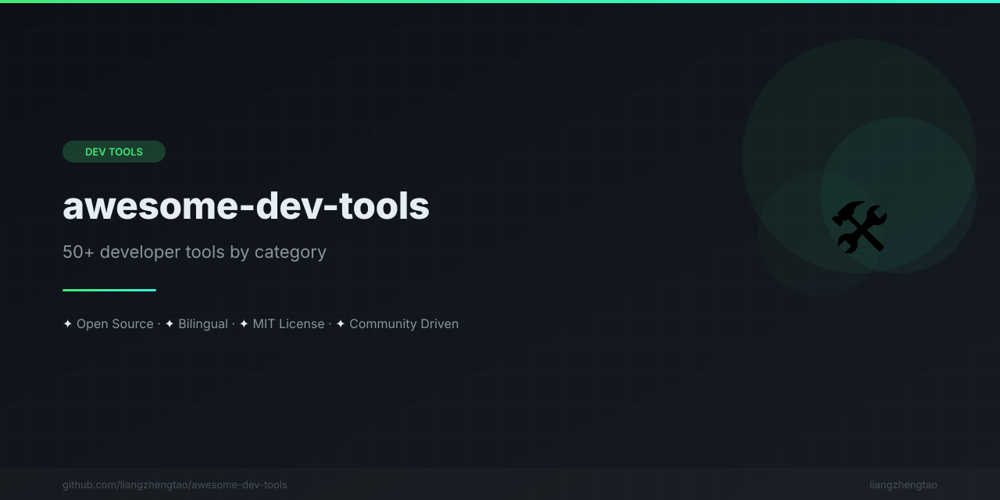

[English](README.md) | [中文](README.zh.md) | [日本語](README.ja.md) | [Français](README.fr.md) | [Español](README.es.md) | [العربية](README.ar.md) | [한국어](README.ko.md) | [Português](README.pt.md) | [Русский](README.ru.md) | [Deutsch](README.de.md)

<div align="center">



</div>


<div align="center">

# 🛠️ Awesome Dev Tools

**もっと早く知りたかった。50以上の厳選開発者ツール、カテゴリ別に整理。**

生産性を向上させる厳選された開発者ツールコレクション。

[](https://awesome.re)
[](CONTRIBUTING.md)
[](LICENSE)
[](#-tools-overview)

</div>

---


## Before vs After

```
❌ これらのツールなし：                     ✅ これらのツールあり：
─────────────────────────                  ─────────────────────────
$ grep -r "TODO" --include="*.py" .        $ rg "TODO" -t py
  （遅い、再帰的、色なし）                     （10倍高速、カラフル、.gitignore対応）

$ find . -name "*.ts" -not -path "*/node*"  $ fd -e ts
  （冗長な構文、フラグを覚える必要）            （直感的、スマートデフォルト）

$ git diff                                  $ git diff (delta)
  （プレーンテキスト、読みにくい）              （シンタックスハイライト、並列表示）

$ cat config.json                           $ bat config.json
  （シンタックスハイライトなし）                （シンタックスハイライト + 行番号）

$ cd /very/long/path/to/project             $ z project
  （毎回フルパスを入力）                        （よく使うディレクトリにスマートジャンプ）
```

## 🚀 クイックスタート：5つだけインストールするなら

時間がないなら、この5つから始めましょう。最大の生産性向上をもたらします：

| # | ツール | おすすめポイント | インストール |
|---|------|-----|---------|
| 1 | **[fzf](tools/终端工具/shell-tools.md#fzf-fuzzy-finder)** | ファイル、履歴、プロセスをあいまい検索 | `brew install fzf` |
| 2 | **[lazygit](tools/终端工具/cli-productivity.md#lazygit)** | Gitがビジュアルで直感的に | `brew install lazygit` |
| 3 | **[ripgrep](tools/终端工具/shell-tools.md#ripgrep-rg)** | grepより10倍速いコード検索 | `brew install ripgrep` |
| 4 | **[GitHub Copilot](tools/AI工具/ai-coding-assistants.md)** | AI搭載コード補完 | VS Code拡張機能をインストール |
| 5 | **[starship](tools/终端工具/shell-tools.md#starship-prompt)** | 美しく情報豊富なシェルプロンプト | `curl -sS https://starship.rs/install.sh \| sh` |

## 📦 ツール一覧

| カテゴリ | 説明 | ツール | リンク |
|----------|-------------|-------|------|
| 🔤 **ターミナルエミュレータ** | ターミナルアプリ | Warp, Alacritty, Kitty, WezTerm, iTerm2, Windows Terminal | [→](tools/终端工具/terminal-emulators.md) |
| 🐚 **シェルツール** | シェル強化 | zsh, fish, starship, zoxide, fzf, ripgrep, fd, bat, eza, delta | [→](tools/终端工具/shell-tools.md) |
| ⚡ **CLI効率化** | CLI生産性 | tmux, jq, yq, httpie, lazygit, lazydocker, tldr, navi, direnv, asdf | [→](tools/终端工具/cli-productivity.md) |
| 📝 **VS Code** | VS Code拡張機能 | 言語、Git、AI、テーマ、生産性向けTop 20拡張 | [→](tools/编辑器/vscode-extensions.md) |
| 💻 **Neovim** | Neovimセットアップ | LazyVim, AstroNvim, NvChad, LSP、プラグイン、キーバインド | [→](tools/编辑器/neovim-setup.md) |
| 🤖 **AIコーディングアシスタント** | AIプログラミングツール | Cursor, Copilot, Claude Code, Kimi Code, Windsurf, Cline | [→](tools/AI工具/ai-coding-assistants.md) |
| 🧠 **AI効率化ツール** | AI生産性 | ChatGPT, Claude, Perplexity, v0.dev, bolt.new, Replit Agent | [→](tools/AI工具/ai-productivity-tools.md) |
| 🖥️ **ローカルAI** | ローカルAI構築 | Ollama, LM Studio, llama.cpp, text-generation-webui | [→](tools/AI工具/local-ai-setup.md) |
| 🔀 **Gitツール** | Git効率化 | lazygit, gitui, tig, git-flow, pre-commit, husky, commitlint | [→](tools/效率工具/git-tools.md) |
| 🌐 **APIツール** | API開発 | Bruno, Insomnia, Hoppscotch, httpie | [→](tools/效率工具/api-tools.md) |
| 🎨 **デザインツール** | 開発者のためのデザイン | Excalidraw, tldraw, Figma, Penpot, draw.io, Mermaid | [→](tools/设计工具/design-for-developers.md) |
| 📸 **スクリーンショット** | スクリーンショット＆ドキュメント | CleanShot X, Shottr, Kap, ScreenStudio, carbon.now.sh, ray.so | [→](tools/设计工具/screenshot-tools.md) |

## 🔥 おすすめ構成

### ベストターミナル構成

```
ターミナル: WezTerm（クロスプラットフォーム、Lua設定）
シェル:    zsh + oh-my-zsh + zsh-autosuggestions
プロンプト: starship
検索:      fzf + ripgrep + fd
モダン:    bat + eza + delta
```

### ベストAIコーディング構成

```
エディタ:  Cursor（または VS Code + Copilot）
CLI:       Claude Code / Kimi Code
検索:      Perplexity
プロトタイプ: v0.dev
ローカル:  Ollama + Continue
```

### ベスト生産性構成

```
Git:       lazygit + pre-commit + commitlint
API:       Bruno（GUI）+ httpie（CLI）
シェル:    tmux + direnv + asdf
ダイアグラム: Excalidraw + Mermaid
スクリーンショット: CleanShot X（macOS）/ ShareX（Windows）
```

## 📖 本リポジトリの使い方

1. **カテゴリで閲覧** - 上記テーブルのリンクをクリック
2. **比較を確認** - 各ファイルに比較テーブルがあります
3. **クイックスタート** - インストール手順に従う
4. **設定** - おすすめ設定をコピー
5. **反復** - 一度に1つずつツールを追加し、マスターしてから次へ

## 🤝 コントリビュート

コントリビューションを歓迎します！まず[コントリビューションガイド](CONTRIBUTING.md)をお読みください。

- 🐛 バグ報告
- 💡 新ツールの提案
- 📖 ドキュメント改善
- 🔧 タイポ修正

## 📄 ライセンス

本プロジェクトはMITライセンスの下で提供されています。詳細は [LICENSE](LICENSE) ファイルをご覧ください。

## 🔗 関連プロジェクト

関連プロジェクトもぜひチェック：

- **[awesome-skills](https://github.com/liangzhengtao/awesome-skills)** - 厳選AIスキルコレクション
- **[awesome-ai-rules](https://github.com/liangzhengtao/awesome-ai-rules)** - AIルールとプロンプト
- **[vibe-check](https://github.com/liangzhengtao/vibe-check)** - プロジェクトの状態チェック
- **[commit-ai](https://github.com/liangzhengtao/commit-ai)** - AI搭載コミットメッセージ
- **[awesome-mcp-servers](https://github.com/liangzhengtao/awesome-mcp-servers)** - MCPサーバーコレクション

---

<div align="center">

**[⬆ トップに戻る](#-awesome-dev-tools)**

</div>

---
