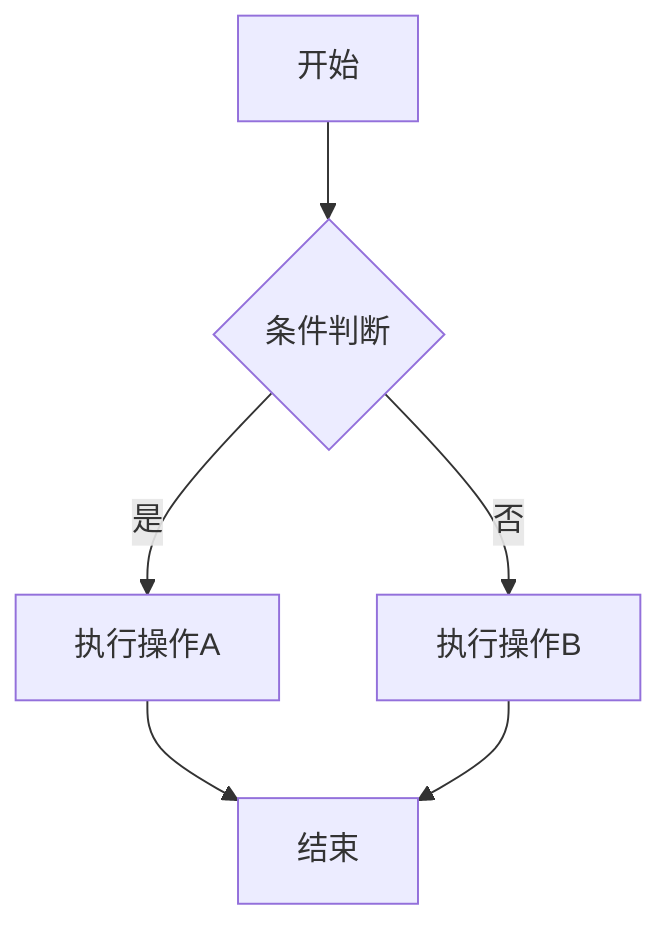
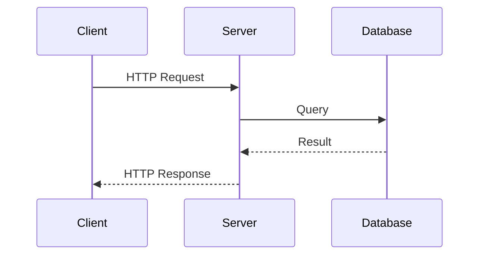
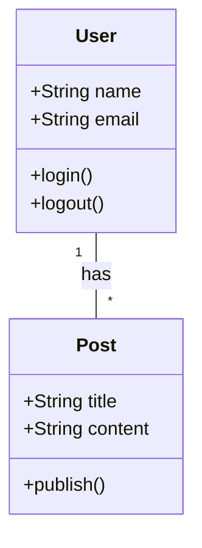
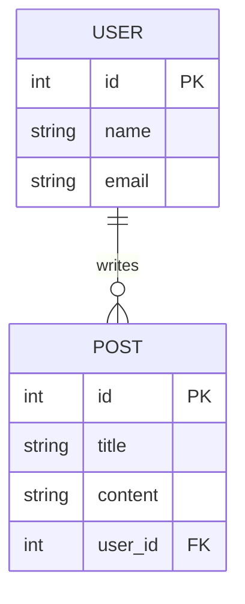
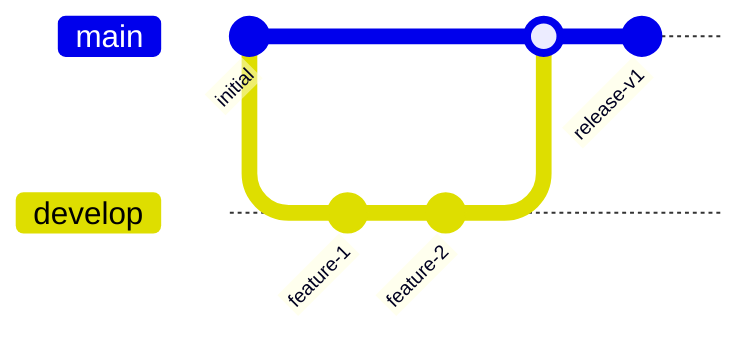

# 开发者设计工具 / Design Tools for Developers

> 不是设计师？没关系。这些工具让开发者也能快速创建美观的图表、原型和设计稿。

## Overview

开发者的设计需求：

- **架构图** - 系统架构、流程图、ER 图
- **线框图** - 快速原型、UI 草图
- **头脑风暴** - 白板、思维导图
- **技术文档** - 图示说明、数据流图

## Comparison Table

| Tool | 类型 | 协作 | 离线 | 开源 | 最佳场景 |
|------|------|------|------|------|----------|
| **Excalidraw** | 手绘白板 | ✅ | ✅ PWA | ✅ | 头脑风暴、快速草图 |
| **tldraw** | 无限画布 | ✅ | ✅ PWA | ✅ | 自由绘图、原型 |
| **Figma** | 专业设计 | ✅ | ❌ | ❌ | UI 设计、设计系统 |
| **Penpot** | 专业设计 | ✅ | ✅ 自托管 | ✅ | 开源 Figma 替代 |
| **draw.io** | 图表工具 | ✅ | ✅ 桌面版 | ✅ | 架构图、流程图 |
| **Mermaid** | 代码图表 | N/A | ✅ | ✅ | 文档中的图表 |

## Quick Start

### Excalidraw（推荐）

```bash
# Web 版（推荐）
# 访问 https://excalidraw.com

# 桌面版
brew install --cask excalidraw

# VS Code 扩展
code --install-extension pomdtr.excalidraw-editor
```

**使用场景：**

```
1. 系统架构图
   - 手绘风格，不追求完美，快速表达想法
   - 支持箭头、方框、文字、自由绘制
   - 实时协作，团队头脑风暴

2. 技术方案讨论
   - 快速画出数据流
   - 标注关键节点
   - 分享链接给团队

3. 白板教学
   - 课堂/会议演示
   - 实时绘图和标注
```

**快捷键：**

```
R - 矩形
O - 椭圆
D - 菱形
A - 箭头
L - 直线
P - 铅笔（自由绘制）
T - 文字
H - 手形（移动画布）
Ctrl+C/V - 复制粘贴
Ctrl+Z - 撤销
Ctrl+Shift+E - 导出图片
```

### tldraw

```bash
# Web 版
# 访问 https://tldraw.com

# 嵌入到项目中
npm install @tldraw/tldraw
```

```tsx
// React 组件中使用
import { Tldraw } from '@tldraw/tldraw'
import '@tldraw/tldraw/tldraw.css'

function Whiteboard() {
  return (
    <div style={{ width: '100vw', height: '100vh' }}>
      <Tldraw />
    </div>
  )
}
```

**特色功能：**
- 无限画布
- 丰富的形状库
- 支持嵌入图片、视频
- 可嵌入到 React 应用中
- 完全开源

### Figma

```
# 访问 https://figma.com
# 免费版足够个人使用

开发者最佳用法：

1. 查看设计稿
   - 打开设计师分享的 Figma 链接
   - 使用 Dev Mode 查看 CSS/代码属性
   - 直接复制样式代码

2. 快速原型
   - 使用 Auto Layout 创建响应式布局
   - 使用组件库快速搭建界面
   - 导出切图和图标

3. 设计系统
   - 创建颜色、字体、间距 Token
   - 使用 Variables 管理设计变量
   - 与代码中的 Design Token 同步
```

**Figma 快捷键：**

```
F - Frame（画框）
R - Rectangle
O - Oval
T - Text
L - Line
P - Pen（钢笔工具）
K - Scale
V - Move
Shift+1 - 缩放到选中元素
Ctrl+Shift+E - 导出
```

### Penpot

```bash
# 在线版
# 访问 https://penpot.app

# 自托管（Docker）
docker compose -f docker-compose.yaml up -d
```

**Penpot vs Figma：**

| 对比项 | Penpot | Figma |
|--------|--------|-------|
| 开源 | ✅ | ❌ |
| 自托管 | ✅ | ❌ |
| 功能完整度 | 85% | 100% |
| 协作 | ✅ | ✅ |
| 插件生态 | 发展中 | 成熟 |
| 价格 | 完全免费 | 免费版有限制 |

### draw.io

```bash
# Web 版
# 访问 https://app.diagrams.net

# 桌面版
brew install --cask drawio

# VS Code 扩展
code --install-extension hediet.vscode-drawio
```

**使用场景：**

```
1. 系统架构图
   - 丰富的形状库（AWS、Azure、GCP 图标）
   - 自动布局
   - 导出 PNG/SVG/PDF

2. 流程图
   - 拖拽式创建
   - 连接线自动吸附
   - 支持泳道图

3. ER 图
   - 数据库模型设计
   - 支持 SQL 导出
   - 表关系可视化

4. 网络拓扑图
   - 网络设备图标库
   - 自定义形状
```

### Mermaid（代码生成图表）

````markdown
# 在 Markdown 中直接写图表代码

## 流程图


## 时序图


## 类图


## ER 图


## Git 图

````

**Mermaid 支持平台：**
- GitHub（原生支持）
- GitLab（原生支持）
- Notion（原生支持）
- Obsidian（原生支持）
- VS Code（Markdown Preview Mermaid 插件）

## Configuration

### 工具选择指南

```
什么时候用什么？

需要快速画草图 → Excalidraw
  - 团队头脑风暴
  - 技术方案讨论
  - 不追求完美，快速表达

需要专业 UI 设计 → Figma
  - 设计师协作
  - 设计系统
  - 高保真原型

需要架构图/流程图 → draw.io
  - 系统架构
  - 数据库 ER 图
  - 网络拓扑图

需要代码生成图表 → Mermaid
  - 技术文档
  - README 中的图表
  - 版本控制友好

需要开源替代 → Penpot / Excalidraw / tldraw
  - 数据隐私
  - 自托管需求
  - 定制化需求
```

## Tips

1. **Excalidraw 是开发者首选** - 手绘风格不追求完美，专注于快速表达想法
2. **draw.io 画架构图** - 丰富的形状库，支持导出多种格式
3. **Mermaid 嵌入文档** - 代码生成图表，Git 友好，Markdown 原生支持
4. **Figma Dev Mode** - 开发者可以直接查看设计稿的 CSS 属性和代码
5. **善用模板** - 大多数工具都提供模板库，不要从零开始
6. **SVG 导出** - 矢量格式，放大不失真，适合文档和演示

## See Also

- [截图工具](./screenshot-tools.md) - 截图和文档工具
- [AI 效率工具](../AI工具/ai-productivity-tools.md) - AI 生成 UI 和原型
